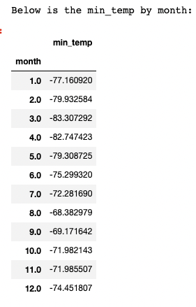
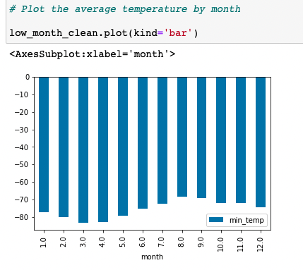
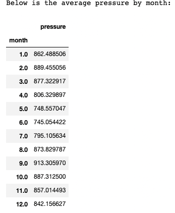
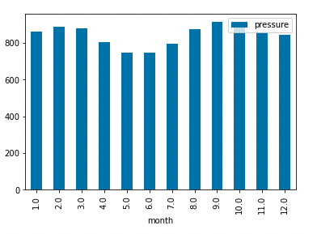
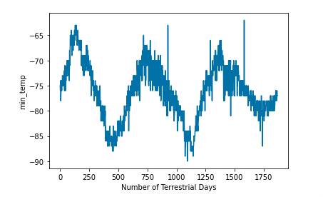

# Mission-to-Mars
Module 11 Challenge - HTML WebScraping

## Deliverable 1:

The Mars news data was succesfully scraped and added to a list of dictionaries as shown below. 

## Deliverable 2: 

The Mars news data was succesfully scraped and added to a pandas DataFrame for analysis as shown below.

Summary of Data Anlysis Findings:
  1. The data shows there are 12 months that exist on Mars. (Knowing Mar's has about 24 months) We must conclude either the definition for the 'month' variable is incorrect or the data is incomplete. 
  2. The range of days available starts at day 10 and extends until day 1977. So there is a date range of 1967 days of Martian data that exist in the scraped dataset. Also note, the number of samples in the data set is 1867. 
  3. I created a cleaned dataframe to view the average min_temp by month. I then plotted this dataframe into a pandas bar chart. The two images are shown below. 
 
  
  
  
  As shown above. The coldest month is August (Month 8) at -83 degrees. The hottest month is April (Month 4) at -68 degrees
  
  4. I created a cleaned dataframe to view the average pressure by month. I then plotted this dataframe into a pandas bar chart. The two images are shown below. 
  
  

  As shown above. The lowest pressure month is June (Month 6) at 745.05. The highest pressure month is September (Month 9) at 913.31.
  
  5. Looking at the amount of terrestrial days between the peaks of temperature changes at day 725 the temperature peaks, then again at day 1425 the temperature peaks. We can infer this is the year based off of the temperature data. So taking 1425-725, we have about 700 terrestrial earth days in a martian year. Internet search confirms that a Mars year is equivalent to 687 earth days.

  

  
