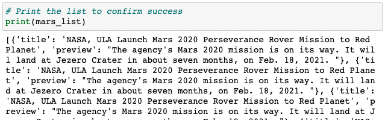
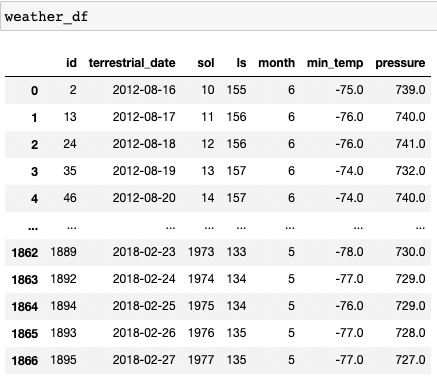

# Mission-to-Mars
Module 11 Challenge - HTML WebScraping

## 1. Overview of Analysis 

## 2. Results

### Deliverable 1:

The Mars news data was succesfully scraped and added to a list of dictionaries as shown below. 

### Deliverable 2: 

The Mars news data was succesfully scraped and added to a pandas DataFrame for analysis as shown below.

Summary of _____:
  1. The 
